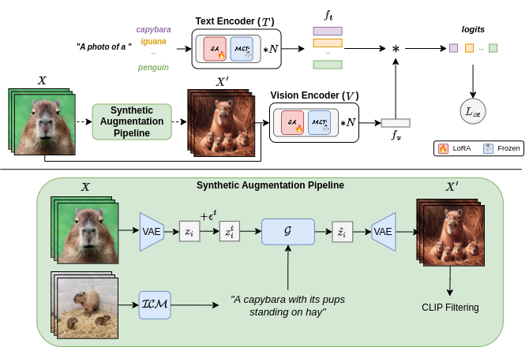

## Overview

<p align="center">
    
</p>

This is the official repository for the paper:
> **[Diversified in-domain synthesis with efficient fine-tuning for few-shot classification](https://arxiv.org/abs/2312.03046)**<br>
> [Victor G. Turrisi da Costa*](https://scholar.google.com/citations?user=UQctXiEAAAAJ&hl=en&oi=ao), [Nicola Dall'Asen*](https://scholar.google.com/citations?user=e7lgiYYAAAAJ&hl), [Yiming Wang](https://scholar.google.co.uk/citations?user=KBZ3zrEAAAAJ&hl=en), [Nicu Sebe](https://scholar.google.com/citations?user=tNtjSewAAAAJ&hl=en) and [Elisa Ricci](https://scholar.google.com/citations?user=xf1T870AAAAJ&hl=en). <br>

The code is divided into two main parts, one for fine-tuning a pre-trained model
in the few-shot scenario (`fine-tune`) and the other for generating synthetic data
to enhance fine-tuning (`generation`).

Each part contains its respective README files available in `fine-tune/README.md` and `generation/README.md` with additional details about installation, code organization and execution.

## Citation
```bibtex
@misc{dacosta2023diversified,
      title={Diversified in-domain synthesis with efficient fine-tuning for few-shot classification}, 
      author={Victor G. Turrisi da Costa and Nicola Dall'Asen and Yiming Wang and Nicu Sebe and Elisa Ricci},
      year={2023},
      eprint={2312.03046},
      archivePrefix={arXiv},
      primaryClass={cs.CV}
}
```
